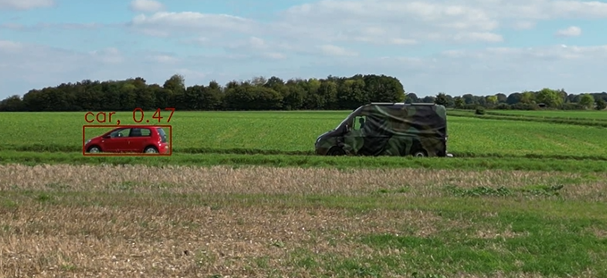

# 3D Adversarial Patches

<!--more-->

  

<!-- # Summary
At Advai, I developed state‑of‑the‑art 3D physical camouflage to fool the latest object detectors models using adversarial techiniques, achieving the strongest recorded attack performance for physical deploments whilst still looking military cammouflaged.

## Goal -->

