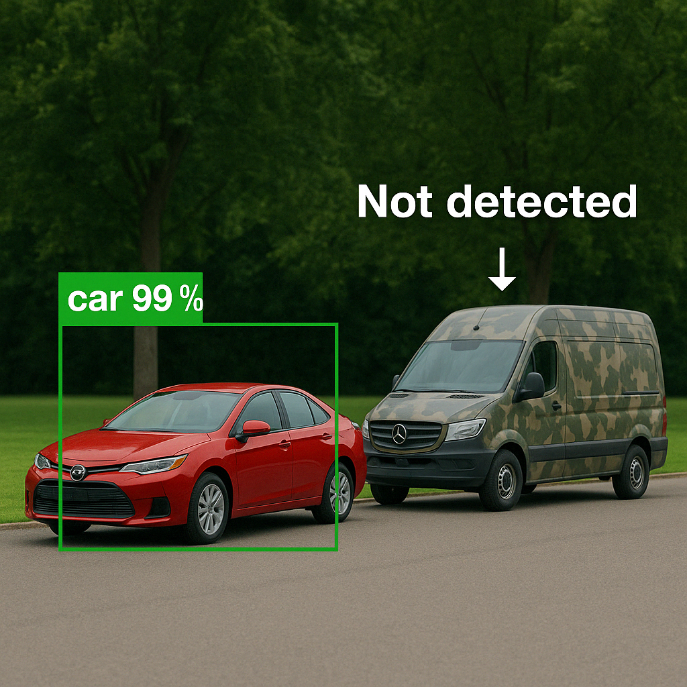

<!--more-->

  

# Overview

While working as an AI safety researcher at Advai, one of my most impactful projects focused on the design and deployment of **3D physical adversarial camouflage** to fool state-of-the-art object detection models, such as those from the YOLO family and Faster R-CNN. Although the specifics of the project are under NDA, this page shares high-level insights into the challenges, innovations, and outcomes of the work.

The goal was to bridge the gap between digital adversarial attacks and **physically deployable camouflage** that remains effective across varying distances, lighting, and camera resolutions—without compromising on visual realism. Our final designs achieved a state-of-the-art misclassification rate in physical environments while still maintaining a plausible military-style appearance.

## What Are 3D Adversarial Attacks?

Traditional adversarial attacks involve adding subtle, often imperceptible perturbations to 2D digital images to fool AI models. In contrast, **3D adversarial attacks** involve modifying the physical appearance of an object—through textures, shapes, or materials—so that it misleads machine learning systems in the real world.

## From 2D Patches to 3D Camouflage

Adversarial patches typically overwrite a portion of an image with carefully optimized noise patterns to force misclassification. However, deploying such patches in real life, especially in operational environments, is vastly more challenging. The project aimed to answer the question:

> _Can we build a robust, real-world deployable adversarial camouflage that degrades AI perception while remaining visually consistent with military aesthetics?_

## Key Contributions

- **High-Resolution Adversarial Textures:** We scaled up from low-res synthetic patches to high-res camouflages that preserve detail and deceive object detectors at long distances.
- **Perceptual Alignment:** We modified standard camouflage patterns to improve realism and remove unnatural high-contrast or white regions that could give the patch away.
- **Physical Deployment Pipeline:** We developed a synthetic testing pipeline to predict real-world performance, which was validated through small- and full-scale deployments on vehicles.
- **Optimized Realism vs. Misclassification:** Through careful loss balancing (classification, perceptual, objectiveness), we achieved high fool rates while maintaining plausible human visual stealth.

## Lessons Learned

- **Real-World Transfer is Hard:** Simulated success doesn’t always translate. Full-scale experiments performed much better than small-scale ones due to better environment realism and training alignment.
- **Viewpoint and Scale Matter:** Performance degraded when viewed from novel angles (e.g. aerial drones) not seen during training, suggesting future work on more diverse EoT (Expectation over Transformation).
- **Partial Patch Failure:** Cutting out parts of the patch significantly hurt performance, though promising early signs suggest this could be trained for.

## Why It Matters

As AI becomes embedded in defense and security systems, **ensuring their robustness to adversarial inputs is critical**. This work demonstrates that not only are digital models vulnerable—but these vulnerabilities can be exploited **physically** in the real world. That has implications for red-teaming, defense resilience, and adversarial robustness research.
