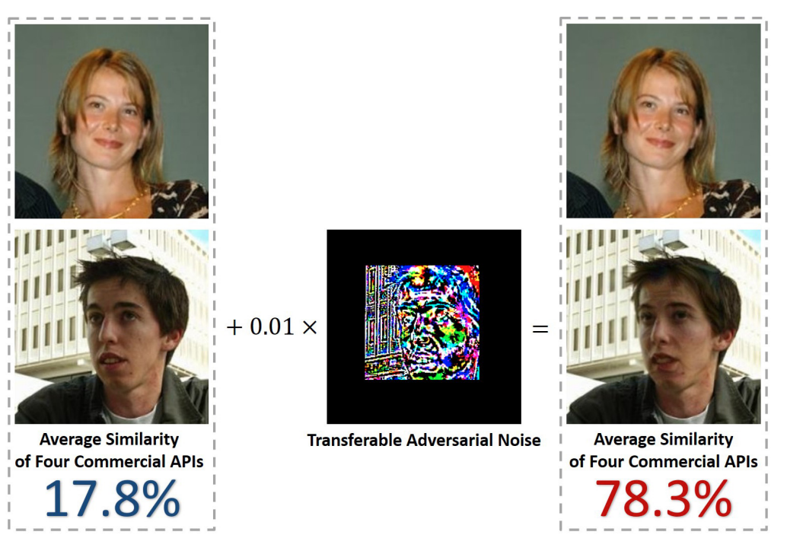

  
    

  

<em>Figure 1: Illustration of how adversarial perturbations can affect face similarity scores. Image adapted from Brown et al., 2020.</em>

## Overview

As part of my work at Advai, I contributed to a confidential red-teaming project evaluating the robustness of a commercial facial verification platform—one of the UK’s most widely deployed systems. The focus was on **AI safety**, specifically understanding how such systems behave under **targeted adversarial attacks** in a **black-box setting**, where model internals are unknown.

The challenge was to simulate how a motivated attacker might manipulate an image to be incorrectly verified as someone else in the system—without triggering biometric defenses like liveness or genuine presence detection. Although technical specifics remain under NDA, the project offered a rare opportunity to test adversarial robustness under realistic deployment conditions.

## What Are Adversarial Attacks in Facial Verification?

Adversarial attacks on facial verification models aim to subtly modify a face image so that a system misclassifies it—either rejecting a valid user or matching it to someone else. These perturbations are often invisible to humans but exploit vulnerabilities in the model’s learned representations.

In black-box scenarios, attackers have no access to the model architecture or weights. Instead, they generate attacks on surrogate models and rely on **transferability**: the hope that perturbations crafted on one model will still fool another.

## Goal

To generate targeted, transferable adversarial attacks against one of the UK’s top commercial facial verification systems, and evaluate their effectiveness across multiple industry-leading platforms. Simply put, the objective was to test whether an image could be subtly modified to be falsely recognized as a specific person in the system — all without access to their underlying model. 

## Results

Although full experimental details are under NDA, our strongest targeted attacks successfully induced misclassification under constrained, black-box conditions—without access to model architecture, parameters, or training data. These attacks were generated using open-source surrogates and remained effective when evaluated against commercial systems via standard user-facing APIs.

The results highlight that even well-established biometric pipelines can be vulnerable to transferable adversarial perturbations in realistic threat scenarios, especially when assurance mechanisms are absent or inconsistently enforced.

## Why It Matters

Facial verification systems are increasingly used across borders, banking, and critical infrastructure. This project reinforced that even large-scale commercial systems—deployed by industry leaders—can remain vulnerable to targeted adversarial attacks. These findings underscore the urgent need for proactive AI safety auditing in domains where identity verification underpins national security, privacy, and public trust.

## Citations

[Brown et al., 2020](https://arxiv.org/abs/2004.05790)
