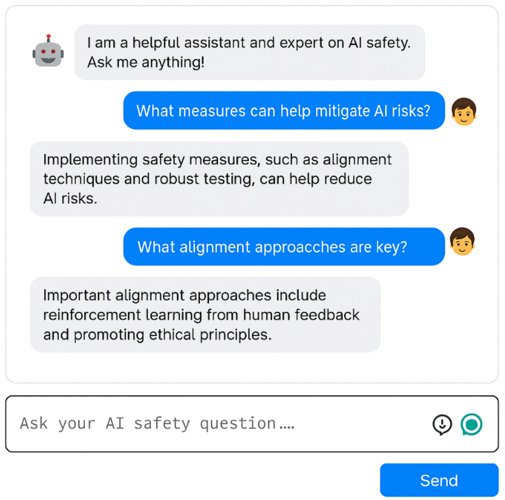

  

This project is a hands-on exploration of Retrieval-Augmented Generation (RAG) using OpenAI's ChatGPT-3.5, powered by LangChain and FAISS.  
It indexes a curated set of AI safety research papers to enable grounded responses from a custom chatbot.

The goal was to deepen my understanding of:
- **RAG architecture and design**
- **LLM deployment pipelines**
- **LangChain and FAISS vector search**
- **Web integration via FastAPI + HTML/JS**

Although this version doesn’t yet use Docker or AWS, they are on the roadmap as part of continued efforts to sharpen my software engineering skills and deploy LLM applications in production environments.

📎 [Launch Chatbot](https://rag-up27.onrender.com/)
